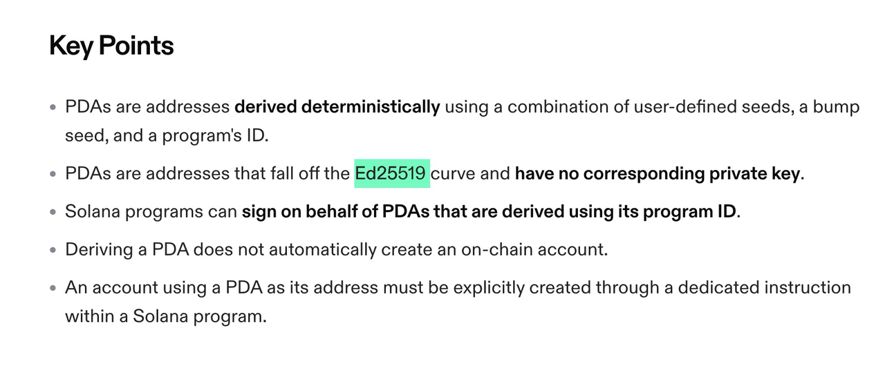
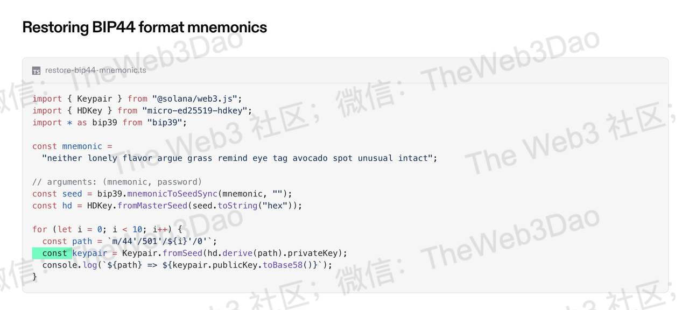

# Solana以及同源链

### 1. 基础信息
- **RPC Base Url**
  - 文档上找的方法： https://solana.com/zh/rpc
  - Google 搜索：solana open node, solana 开放节点，当然如果要商用需要交费。

- **账户模型和 UTXO 模型**
  - Solana是账户模型
  - 调用 RPC getTransaction 接口
  - Request:
    ```bash
    curl --location 'https://go.getblock.io/70f479b9ed834b5f96a26934e0492b36' \
    --header 'Content-Type: application/json' \
    --data '{
        "jsonrpc": "2.0",
        "id": 1,
        "method": "getTransaction",
        "params": [
          "3bWvYMwvDgYyyr9jamh57dFc2atfZhBS2HhHqNKyGdUx9UwLQwS7hJ5WHaei9QqsDHyGp4ypn79uWystJ1G2pJZN",
            {
                "encoding": "jsonParsed",
                "maxSupportedTransactionVersion": 0
            }
        ]
      }'
    ```
  - Response:
    数据太长，就不贴出来了，你会看到没有一份交易没有 vin vout 这样的字眼。

### 2. 加密，签名与地址编码
- **签名算法**：EDDSA ： ed25519
  - 从官方文档里面找到：
    
  - Github: https://github.com/anza-xyz/agave, 搜索代码库发现是 ED25519 算法

- **是否有特定签名方案**（如 Algorand 的多重签名、Cosmos 的 bech32 地址编码）
  - 无
- **地址格式与生成方式**
  - 调研到了：https://github.com/anza-xyz/solana-web3.js 官方代码库
    

### 3. 代币 & NFT 兼容性
- **代币精度**：代币最小单位，是否支持小数转换（精度计算方式）
  - 精度为 9，公链代码：
    ```rust
    pub fn sol(amount: u64) -> Self {
      Self {
          amount,
          decimals: 9,
          token_type: TokenType::Sol,
      }
    }
    ```
- **是否支持代币（Token）和 NFT**
  都支持，合约开发语言为Rust或C

### 4. 共识机制与交易确认
- **共识机制**
  - 文档里面找：共识算法比较优质的链，他们会把共识算法放到显眼的位置
  - 公链代码里面找
  - 直接搜索
  - 得出来的结论：POH + DPOS
- **确认机制**
  - 需要多少个确认数？（BTC 6 确认，ETH 12 秒 1 块）
  - 是否支持质押（PoS 链通常支持）
- **质押（Staking）方式**
  - 可以任意数量质押之后委托给矿池，但是会被锁定至少一个周期

### 5. 交易细节
- **是否支持 Tag/Memo**：
  - 不支持
- **是否为多链结构**
  - Solana 是单链
- **钱包的跨链能力**
  - 是否支持跨链转账
  - 是否支持桥接（Bridge）

### 6. 开发离线签名 SDK
- **官方 SDK 是否支持当前开发语言**
  - 从官方文档里面找到：
    
  - Github: https://github.com/anza-xyz/agave, 搜索代码库发现是 ED25519 算法

### 7. 区块扫描
- **中心钱包扫链（区块同步）所需的 RPC 接口与 HD 钱包所需要的接口**
